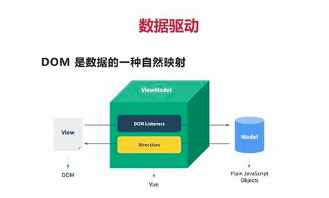

# 理解Vue的设计思想 MVVM
将视图View的状态和行为抽象化，让我们将视图UI和业务逻辑分开。


MVVM的三要素：数据响应式、模板引擎、渲染
数据响应式：监听数据变化并在视图中更新
+ Object.defineProperty()
+ Proxy

模板引擎：提供描述视图的模板引擎
+ 插值表达式：{{}}
+ 指令：v-bind、v-on、v-model、v-for、v-if...

渲染：将模板转换成html
+ 模板 => vDom => dom

## 数据响应式原理
数据变更能否响应在视图中，就是数据响应式。
利用`Object.defineProperty()`实现变更检测。 

```js
// reactive.js
function defineReactive(obj, key, val) {
    // 循环
    observe(val);
    Object.defineProperty(obj, key, {
        get() {
            console.log('get', key);
            return val;
        },
        set(v) {
            if (v !== val) {
                val = v;
                observe(v);
                console.log('set', key, val);
            }
        },
    })
}

function set(obj, key, val) {
    // 新增属性再次调用监听
    defineReactive(obj, key, val);
}

function observe(obj) {
    if (typeof obj !== 'object' || obj === null) {
        return obj;
    }
    Object.keys(obj).forEach(key => defineReactive(obj, key, obj[key]));
}

const obj = {
    foo: 'foo',
    bar: 'bar',
    baz: {
        a: 1
    },
    arr: [1, 2, 3],
};
// 对obj进行响应式处理
observe(obj);

obj.foo; // get
obj.foo = '111'; // set
obj.bar; // get
obj.bar = '222'; // set
obj.baz; // get
obj.baz.a = 'aaa'; // set
obj.baz = {   // set
    a: 10
}
obj.baz.a = '10aaa'; // set
obj.doo = 'doo';
obj.doo;
set(obj, 'doo', 'doo');
obj.doo = 'doo1'; // set
obj.doo; // get

// 数组  重写数组的7个方法实现拦截  push pop shift unshift sort splice reverse
obj.arr[0]; // get
obj.arr[0] = 2; // set
obj.arr.push(4);
```
数组使用索引访问和赋值可以被监听到，但是使用Array的方法操作数组就监听不到了。
要想实现监听，就需要重写数组的7个方法实现拦截。

简单实现将`js`中对象的`time`属性渲染到`html`。
```html
<div id="app"></div>
<script>
    // 首先引入上面的script代码，即reactive.js
    // 放开其中的Object.defineProperty 中set的update
    const app = document.querySelector('#app');
    function update(val) {
        app.innerText = val;
    }
    const obj = {time: 0};
    observe(obj);
    setInterval(() => {
        obj.time = new Date().toLocaleTimeString();
    }, 1000);
</script>
``` 

## vue中的数据响应式
原理分析：
1. `new Vue()`首先执行初始化，对data执行响应式处理，这个过程发生在Observer中
2. 同时对模板执行编译，找到其中动态绑定的数据，从data中获取并初始化视图，这个过程发生在Compile中
3. 同时定义一个更新函数和Watcher，将来对应数据变化时Watcher会调用更新函数
4. 由于data的某个key在一个视图中可能出现多次，所以每个key都需要一个管家Dep来管理多个watcher
5. 将来data中数据一旦发生变化，会首先找到对应的Dep，通知所有Watcher执行更新函数


### 涉及类型介绍
+ Kvue: 框架构造函数
+ Observer: 执行数据响应化（分辨数据是对象还是数组）
+ Compile: 编译模板，初始化视图，依赖收集（更新函数，watcher创建）
+ Watcher：执行更新函数（跟新dom)
+ Dep：管理多个watcher，批量更新

#### Kvue
框架构造函数：执行初始化
+ 执行初始化，对data执行响应化处理，主要是下面代码中的`proxy`
  ```js
  function defineReactive(obj, key, val) {
    observe(val);
    Object.defineProperty(obj, key, {
      get() {
        console.log('get', key);
        return val;
      },
      set(v) {
        if (v !== val) {
          val = v;
          observe(v);
          console.log('set', key, val);
          // update(val);
        }
      },
    })
  }

  function observe(obj) {
    if (typeof obj !== 'object' || obj === null) {
      return obj;
    }
    Object.keys(obj).forEach(key => defineReactive(obj, key, obj[key]));
  }
  
  function proxy(vm) {
    Object.keys(vm.$data).forEach(key => {
      Object.defineProperty(vm, key, {
        get() {
          return vm.$data[key];
        },
        set(val) {
          vm.$data[key] = val;
        }
      })
    })
  }

  class Kvue {
    constructor(options) {
      // 1.保存选项
      this.$options = options;
      this.$data = options.data;
      // 2.对data选项做响应式处理
      observe(this.$data);
      // 2.5代理
      proxy(this);
      // 3.编译
    }
  }
  ```
+ 编译 Compile
  编译模板中Vue模板特殊语法，初始化视图、更新视图
  编译dom->遍历子节点->编译节点（编译文本）->遍历属性(事件)->监听input、处理textContent、innerHtml、绑定click等
  
  


